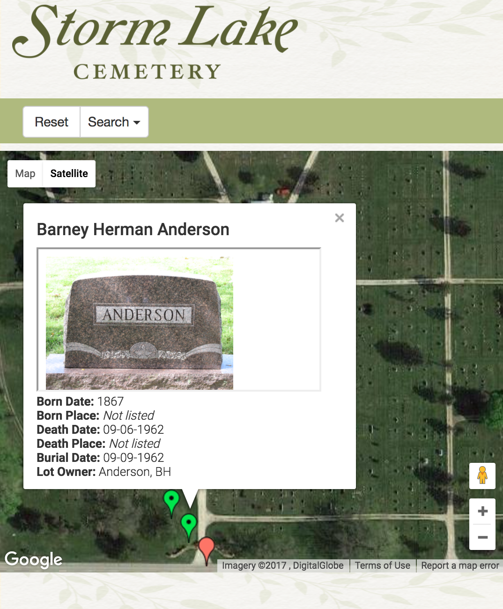

cemetery-map
============
The cemetery-map Web application is a responsive Python+Flask+SQLAlchemy+Google
Maps app that allows people to search for loved ones in a cemetery.  This
application is a Flask rewrite of a previous Node.js app written by
[jbshep](http://github.com/jbshep) and his students, which was designed
specifically for the cemetery in Storm Lake, Iowa, U.S.A.

## Installation

Those interested in contributing code are encouraged to use virtualenv to
manage their Python version, site-packages, and environment variables.  After
downloading and installing virtualenv, developers can create a virtual
environment in a directory named `env` by typing something like
`pyvenv-3.5 env`.  To activate new virtual environment, developers should
create their own `.env` file that can be sourced (i.e., the command to be typed would be `source .env`)
to populate the shell with important environment variables that contain
API keys, database URL's, and other configuration values that are defined
in `config.py`.  A sample `.env` file can be found in the repository root; it
is named sample.env.

To begin installation of the app, you must first install PostgreSQL and add
PostgreSQL's bin directory to your path.  Run psql and type the command `create
database cemdb;`  You can then build and run the app as follows:
```console
pip3 install -r requirements.txt
python3 manage.py db upgrade
python3 manage.py runserver
```

You can now browse to [http://localhost:5000/](http://localhost:5000/) to view the running app.

If you did not add PostgreSQL's bin directory to your PATH prior to executing
the above commands, you will likely see the error `Error: pg_config executable
not found.`

## Deploying on Heroku

New developers can develop locally on their own computers.  However, at some point you may wish to deploy to the cloud.  This section describes how to deploy cemetery-map to Heroku.  You only need to complete the instructions in this section if you want to deploy to Heroku.

First, obtain a Heroku user ID and install the Heroku toolbelt by visiting [Heroku.com](http://www.heroku.com/).  When you are logged in to the Heroku Web site and the developer dashboard, create a new Python app named cemetery-map.  If that name is currently in use, you may choose a slightly different name.  Then, in your shell in your local repository directory, type the following commands; these assume your app is named cemetery-map.

First, give the Heroku toolbelt your Heroku developer credentials by typing:
```console
heroku login
```

Then, add a new git remote for Heroku so that we can push code to it.
```console
heroku git:remote -a cemetery-map
git push heroku master
```

Our Heroku instance has environment variables that contain configuration information the same way we store info in environment variables within our virtual environment.  We can see what variables have been defined by executing:
```console
heroku config --app cemetery-map
```

Initially the above command will return nothing.  To add config variables for our Heroku app, use the `config:set` command, like this:
```console
heroku config:set APP_SETTINGS=config.ProductionConfig --remote heroku
```

Consult `config.py` to see which environment variables will need to be defined.

Finally, run the DB migrations remotely to create the necessary database tables.

```console
heroku run python manage.py db upgrade --app cemetery-map
```

## Contributing

BVU students interested in contributing should write code that conforms to the
[PEP8](https://www.python.org/dev/peps/pep-0008/) coding standards.  Individual files should be checked by typing `pep8 filename`.  Developers are encouraged to use GitHub's fork/pull request mechanism for contributing to this repository.
